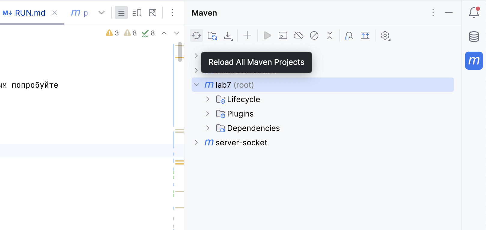
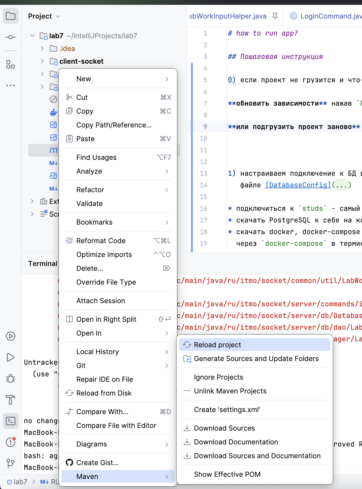
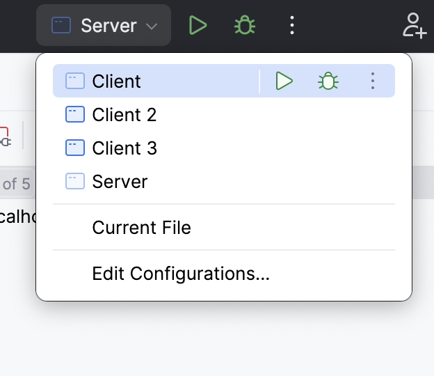
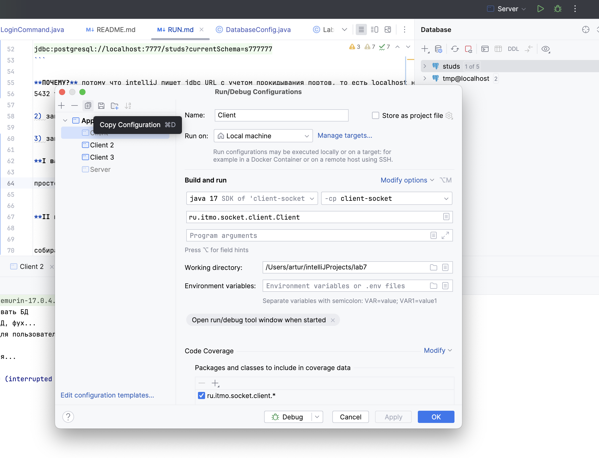

# how to run app?

## Пошаговая инструкция

0) если проект не грузится и что-то подчеркивается красным попробуйте 

**обновить зависимости** нажав `Reload All Maven Projects`



**или подгрузить проект заново** нажав на [pom.xml](pom.xml) правой кнопкой и затем `maven` -> `reload project`




1) настраиваем подключение к БД в
   файле [DatabaseConfig](server-socket%2Fsrc%2Fmain%2Fjava%2Fru%2Fitmo%2Fsocket%2Fserver%2Fdb%2FDatabaseConfig.java)

* подключиться к `studs` - самый простой вариант
* скачать PostgreSQL к себе на комп и у себя создать БД и подключиться к ней
* скачать docker, docker-compose и поднять контейнер с PostgreSQL (внизу инструкция как запустить докер контейнер
  через `docker-compose` в терминале)

ПРИМЕР настройки подключения к БД `studs`

Пусть у меня будет табельный `s777777`

тогда мой конфиг будет выглядеть примерно так:

```java
    private static final String URL = "jdbc:postgresql://localhost:7777/studs?currentSchema=s777777";
    private static final String USER = "s777777";
    private static final String PASSWORD = "1234";
```

* `user` = currentSchema = user on helios
* `password` - посмотрите у себя на helios 
просто можете подключиться ssh `s777777@se.ifmo.ru -p 2222` и выведите содержимое **.pgpass** `cat ~/.pgpass`

в нашем примере вот так: (пароль 1234)
```text
*:*:*:s777777:1234
```

теперь прокинем порты через SSH

```shell
    ssh -L 7777:localhost:5432 s777777@se.ifmo.ru -p 2222 
```

и вводите свой пароль

Прокинуть порт значит что ssh туннель будет перенаправлять запросы с вашего порта 7777 вашей локальной машины на порт
5432 (localhost-а) se.ifmo.ru

сессия не должна тухнуть! Если протухает то по новой открываем терминал и прогоняем

**INTELLIJ**

Важная вещь про intelliJ - если вы там настраиваете подключение к БД и хотите посмотреть что у вас с данными то вот гайд
https://github.com/CandyGoose/Database_SE?tab=readme-ov-file

учтите что В **intelliJ jdbcUrl неправильный** он у вас будет

```text
jdbc:postgresql://localhost:5432/studs
```

а на деле в Server

```text
jdbc:postgresql://localhost:7777/studs?currentSchema=s777777
```

**ПОЧЕМУ?** потому что intelliJ пишет jdbc URL с учетом прокидывания портов, то есть localhost на se.ifmo.ru и port =
5432 тоже там, убедитесь в этом если поменяете хост на pg тоже будет работать))))

2) запускаем Server через IntelliJ

3) запускаем 3-4 Client

**I вариант**

просто копируем конфигурацию Client и запускаем 3 раза:



Для этого заходим в `Edit Configurations...` и копируем конфигурацию `Client` примерно так:



**II вариант**

собираем `.jar` файл клиента чтобы запустить несколько клиентов

как это сделать? - запускаем в терминале intelliJ:

можно нажать `Ctrl+Ctrl` откроется run anything

```shell
  mvn clean install
```

это команда maven которая удаляет генерируемую папку [target](common-socket%2Ftarget) (не только в client, но и в server
и в common)
и генерирует НОВЫЕ `.jar` с последними изменениями в коде
нас интересует именно [client-socket/target/client-socket.jar](client-socket%2Ftarget%2Fclient-socket.jar)

эта папка появится у вас после mvn clean install

Далее открываем терминал можно и intelliJ, можно обычный (главное чтобы java работала в терминале)

как проверить? - запускаем команду

```shell
  java --version
```

если на экране вывелась версия то все ок)

далее открыли мы терминал и че? Идем в папку [client-socket](client-socket)
и дублируем терминалы до 4 штук (то есть открываете 4 терминала все в папке [client-socket](client-socket))

Запускаем по очереди 4 клиента (в 4 разных терминалах, ТОЛЬКО 3 подключатся)

```shell
  java -jar target/client-socket.jar
```

4) Смотрим логи SERVER

и должны увидеть в Server что подключилось 3 из 4!!!!

```text
Сервер запущен и ожидает подключения...
[Tech] [INFO] Клиент [unauthorized_1] подключился 
[Tech] [INFO] Клиент [unauthorized_2] подключился 
[Tech] [INFO] Клиент [unauthorized_3] подключился 
```

потому что `ru.itmo.socket.common.util.ConnectionContext.MAX_CONNECTIONS = 3`
4 специально не принимается) вот и все

5) далее выполняем register login
   так как без login нельзя выполнить другие команды :)

```text
    register
    lol
    lol
```

```text
    login
    lol
    lol
```

```text
Отправлено клиенту [lol] вывод команды: login
```

6) Все вы залогинены) так что можно прогонять команды
   help, show, add ,....

кстати при add была добавлена автогенерация чтобы 3 часа не вводить каждый раз сущность!

7) Насладитесь победой 

## docker

Инструкция как через docker-compose запустить PostgreSQL

0) скачиваем docker, docker-compose

**START**
создаем контейнер

```shell
docker-compose -f docker-compose.yml up -d
```

**CHECK POSTGRESQL CONTAINER**
чекаем что он жив

```shell
docker ps
```

**END**
удаляем контейнер ВМЕСТЕ С СОДЕРЖИМЫМ

```shell
docker-compose down -v
```

(если не хотите удалять сожержимое то не пишите `-v` флаг)

Удачи :) 